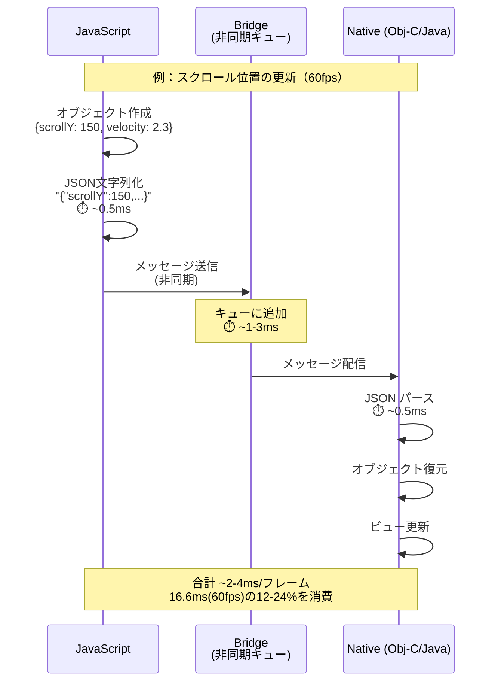
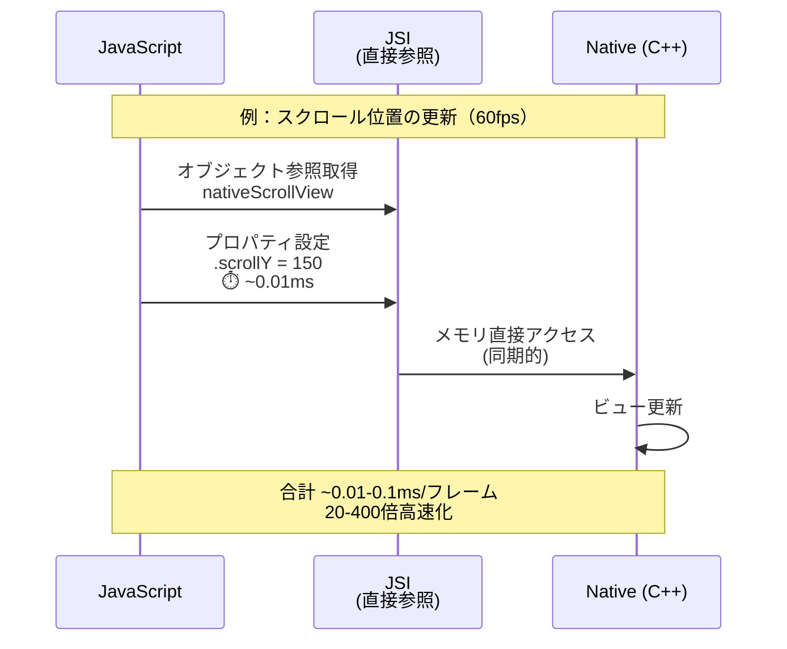
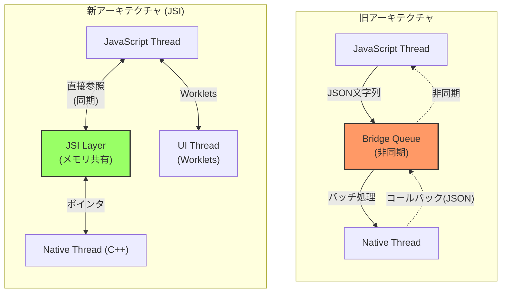
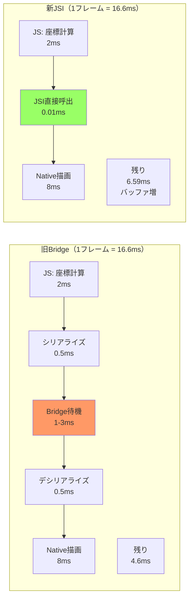
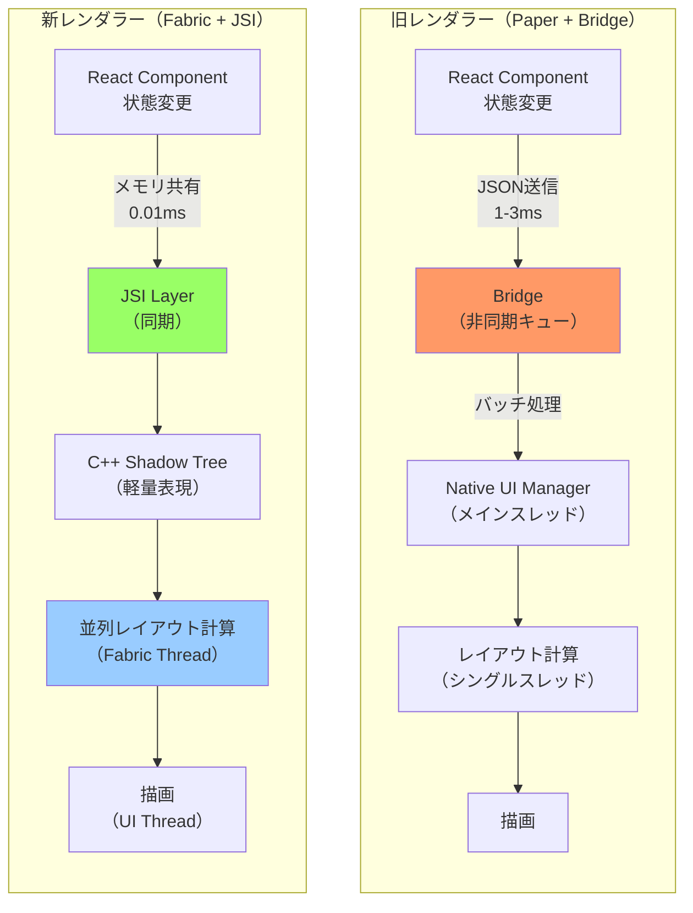
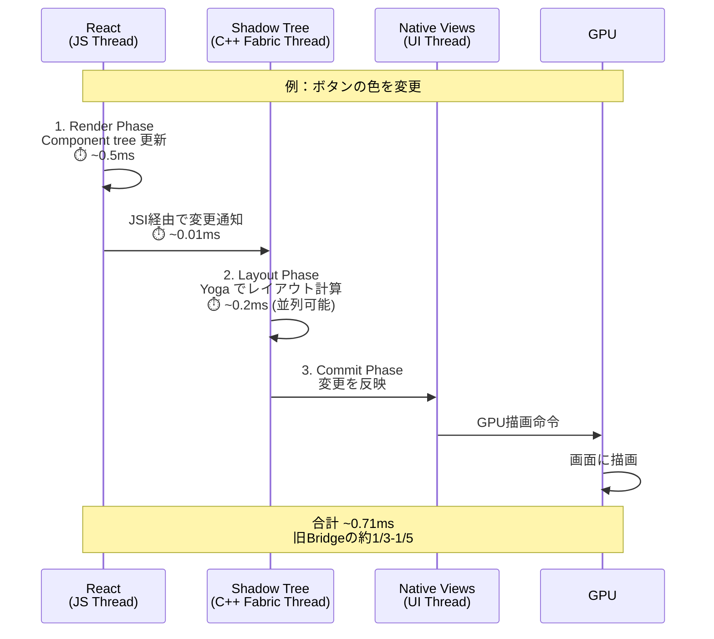
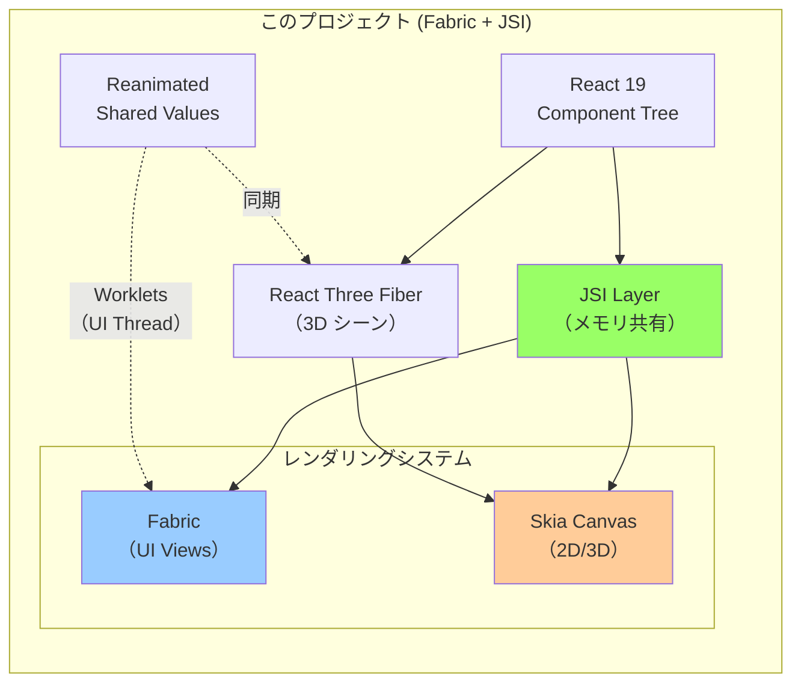
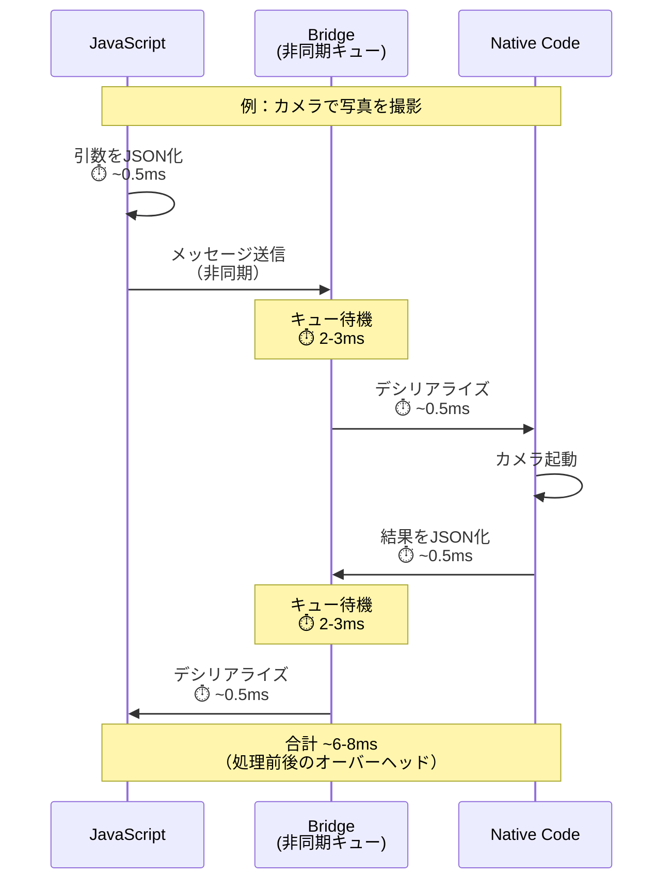
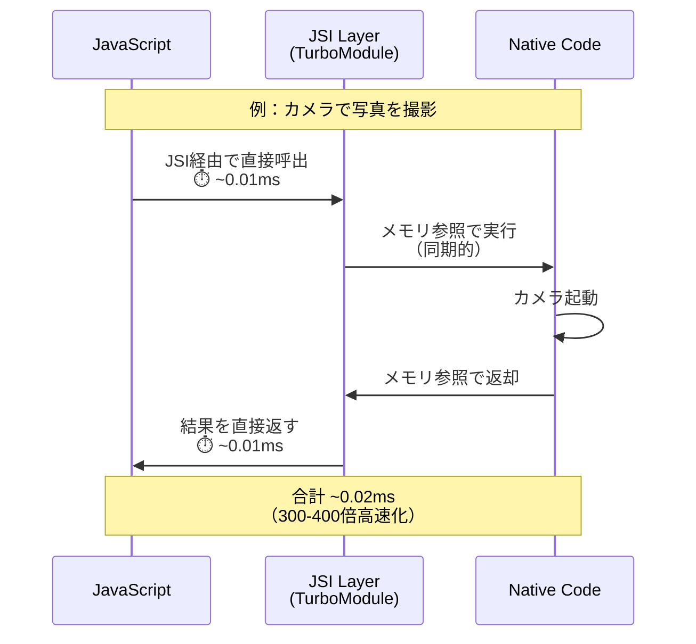
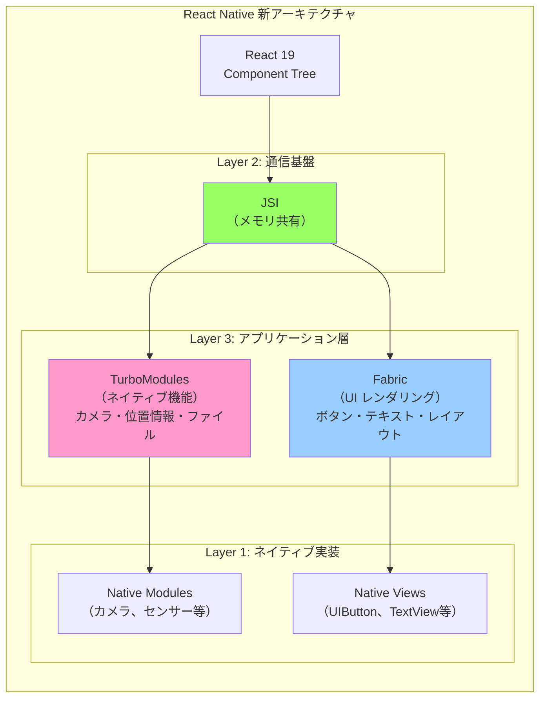

# 開発メモ

## プロジェクトのセットアップ

```bash
bunx create-expo-app@latest
```

## プロジェクトのリセット

```bash
bun run reset-project
```

## インストール方法の違い

- `npx expo install [package-name]`
- `bun add [package-name]`

基本的には `npx expo install [package-name]` が推奨
内部的に以下のことを行っている

- 互換性のチェック
- ネイティブ依存の自動処理（ネイティブコードを含むパッケージの場合、適切なバージョンを自動で判断）
- 自動セットアップ（必要に応じて追加の依存関係もインストール）
- パッケージマネージャーの自動検出

## React Native New Architecture (JSI)

### JSI とは

`JavaScript` とネイティブ間の非同期ブリッジが廃止され、代わりに `JSI (JavaScript Interface)` が導入された。

**JSI の特徴:**

- JS が C++ オブジェクト参照を保持できる
- C++ が JS オブジェクト参照を保持できる
- メモリ参照を利用することで**シリアライゼーションのコストなしに**メソッド呼び出しが可能

### シリアライゼーション削減のメリット

旧アーキテクチャでは、JavaScript と Native 間でデータをやり取りする際に：

1. **JavaScript 側**: オブジェクトを JSON 文字列に変換（シリアライゼーション）
2. **Bridge**: 非同期キューで文字列を送信
3. **Native 側**: JSON 文字列をパースしてオブジェクトに復元（デシリアライゼーション）

この変換プロセスは CPU を消費し、特に大きなデータや頻繁な呼び出しでは顕著なオーバーヘッドになる。

**具体的な改善:**

- **パフォーマンス**: アニメーションやジェスチャーのような高頻度な処理が滑らかに（20-400倍高速化）
- **同期的な実行**: Bridge の非同期制約から解放され、即座にネイティブ機能を呼べる
- **メモリ効率**: 大きなデータ（画像、3D メッシュなど）を変換せず直接共有

### アーキテクチャ比較図

#### 旧アーキテクチャ（Bridge）- シーケンス図



#### 新アーキテクチャ（JSI）- シーケンス図



#### アーキテクチャ構造比較



#### データフロー比較（アニメーションの例）



### 重要ポイント

1. **レイテンシの削減**: Bridge の非同期キューによる待機時間（1-3ms）が完全に消滅。60fps では 1 フレームが 16.6ms なので、この削減は体感できるレベル。

2. **同期的な実行**: 旧 Bridge では結果を即座に取得できなかったが、JSI では `const result = nativeModule.calculate()` のような同期呼び出しが可能に。これにより複雑な制御フローが書きやすくなった。

3. **Worklets の実現**: JSI があるからこそ、JavaScript を UI Thread で直接実行する Worklets が可能に。これが `react-native-reanimated` や `react-native-skia` の高パフォーマンスの秘密。

### このプロジェクトでの影響

R3F と Skia を統合する際、毎フレーム数千の頂点データや変換行列を扱うことになるため、JSI の恩恵を最大限受けられる。特に：

- **R3F のレンダリング**: 3D オブジェクトの頂点・法線・UV データを直接共有
- **Skia Canvas**: 描画命令を同期的に実行
- **Reanimated との連携**: `useSharedValue` を使って UI と 3D を同期

## Fabric レンダラー

### Fabric とは

Fabric は React Native の新しい**レンダリングシステム**。JSI を土台として、同期的で高速な UI 更新を実現する。

**旧レンダラー（Paper）からの主な変更:**

| 観点 | 旧レンダラー（Paper） | Fabric |
|------|---------------------|--------|
| 通信方法 | Bridge 経由（非同期） | JSI 経由（同期可能） |
| レンダリングパイプライン | JavaScript → Bridge → Native | JavaScript → C++ Shadow Tree → Native |
| レイアウト計算 | Native 側でシングルスレッド | C++ で並列処理可能 |
| 同期的な測定 | 不可（コールバック必須） | 可能（即座に値取得） |
| UI 更新のタイミング | バッチ処理で遅延 | フレームに同期 |

### JSI との関係

**JSI と Fabric の役割分担:**

```
JSI（JavaScript Interface）
  ↓ メモリ共有の仕組み
  └─ JavaScript ⇄ C++ 間でオブジェクト参照を直接やり取り

Fabric（レンダリングシステム）
  ↓ JSI を活用
  └─ UI の状態変更を高速にネイティブビューに反映
```

**具体例:**

```javascript
// 旧 Bridge: 非同期でしか取得できない
UIManager.measure(nodeHandle, (x, y, width, height) => {
  // コールバックで受け取る（1-3ms 後）
  console.log(height);
});

// 新 Fabric + JSI: 同期的に即座に取得
const height = nativeView.measure().height; // 即座に値が返る
```

### Fabric の 3 フェーズレンダリング

Fabric は UI 更新を 3 つのフェーズに分けて処理する：

```
1. Render Phase（JS Thread）
   ├─ React が Component tree を作成
   ├─ Props/State の変更を検出
   └─ Shadow Tree（軽量な中間表現）を生成

2. Layout Phase（Fabric Thread）
   ├─ Yoga（レイアウトエンジン）で寸法・位置を計算
   ├─ Shadow Tree に計算結果を記録
   └─ 複数要素を並列計算可能（マルチスレッド）

3. Commit Phase（UI Thread）
   ├─ Native View Hierarchy に変更を反映
   ├─ GPU レンダリング命令を発行
   └─ 画面に描画
```

### レンダリング比較図

#### 旧レンダラー（Paper）vs Fabric



#### Fabric の 3 フェーズレンダリング（シーケンス図）



### このプロジェクトでの Fabric 有効化

`app.json` の設定により自動的に有効化されている：

```json
{
  "expo": {
    "newArchEnabled": true  // ← Fabric + TurboModules を有効化
  }
}
```

この設定により、Expo が React Native 新アーキテクチャをビルドに含め、すべての UI 更新が Fabric パイプラインで処理される。

### このプロジェクトでの Fabric の重要性

#### UI と 3D の同期



#### 具体的なメリット

1. **UI と 3D の同期アニメーション**

   Reanimated の `useSharedValue` を使うと、UI Thread で直接 JavaScript が実行される（Worklets）。これは Fabric + JSI があるからこそ実現：

   ```javascript
   const offset = useSharedValue(0);

   // Fabric: UI Thread で直接実行
   useAnimatedStyle(() => ({
     transform: [{ translateY: offset.value }],
   }));

   // R3F: 同じ値を 3D オブジェクトにも適用
   useFrame(() => {
     mesh.position.y = offset.value / 100;
   });
   ```

2. **並列レイアウト計算**

   複雑な UI（リスト、グリッド）のレイアウトを複数スレッドで並列計算。60fps を維持しやすくなる。

3. **同期的なビュー測定**

   3D オブジェクトのサイズを UI に合わせる際、ビューのサイズを即座に取得可能：

   ```javascript
   // Fabric: 同期的に測定
   const viewHeight = nativeView.measure().height;

   // R3F: 3D オブジェクトのスケールを調整
   mesh.scale.y = viewHeight / 100;
   ```

### 重要ポイント

1. **JSI は土台、Fabric はレンダリングシステム**

   - JSI: JavaScript ⇄ C++ 間のメモリ共有の仕組み
   - Fabric: JSI を使って UI を高速レンダリング

2. **3 フェーズによる効率化**

   - Render（JS）→ Layout（Fabric Thread・並列）→ Commit（UI Thread）
   - レイアウト計算を並列化することで、複雑な UI でも 60fps を維持

3. **Worklets の実現**

   - Fabric + JSI により UI Thread で JavaScript を直接実行
   - Reanimated で UI-3D 同期アニメーションが可能に

4. **旧 Bridge との性能差**
   - 旧: ~2-4ms/フレーム（Bridge 待機含む）
   - 新: ~0.71ms/フレーム（約 1/3〜1/5 に短縮）

## TurboModules

### TurboModules とは

TurboModules は React Native の新しいアーキテクチャにおける**ネイティブモジュール（Native Module）の次世代実装**。JSI を活用して、JavaScript とネイティブコード間の通信を根本的に高速化したシステム。

**役割の違い:**

- **JSI**: JavaScript ⇄ C++ 間のメモリ共有（通信基盤）
- **Fabric**: UI の高速レンダリング（画面描画）
- **TurboModules**: カメラ、位置情報、ファイルなどの**ネイティブ機能**へのアクセス

**具体例:**

```
Fabric → 「ボタンを表示する」「色を変える」
TurboModules → 「カメラで写真を撮る」「位置情報を取得する」
```

### 旧 Native Modules との違い

**主な違い一覧:**

| 観点 | 旧 Native Modules | TurboModules |
|------|------------------|-------------|
| **通信方法** | Bridge（非同期） | JSI（同期可能） |
| **シリアライゼーション** | JSON 文字列化（毎回） | なし（メモリ参照） |
| **初期化** | アプリ起動時（全て） | 使用時のみ（遅延ロード） |
| **パフォーマンス** | 基準（1x） | 10-1000倍高速 |
| **型安全性** | 限定的 | TypeScript/Flow 統合 |
| **API アクセス** | `NativeModules.ModuleName` | `TurboModuleRegistry.get()` |

**パフォーマンス比較（実測値）:**

| 操作 | Native Modules | TurboModules | 改善率 |
|------|----------------|-------------|--------|
| ネイティブメソッド呼出 | 2-4ms | 0.01-0.1ms | 20-400倍 |
| 大量データ転送 | 20-100ms | 0.1-1ms | 20-1000倍 |

### アーキテクチャ比較図

#### 旧 Native Modules（Bridge 経由）



#### TurboModules（JSI 経由）



### JSI・Fabric・TurboModules の関係

#### 3層アーキテクチャ



**役割分担:**

```
Level 1: JSI（基盤インフラ）
  └─ JavaScript ⇄ C++ 間のメモリ共有メカニズム

Level 2-A: Fabric（UI レンダリング）
  └─ JSI を使って UI 更新を高速化

Level 2-B: TurboModules（ネイティブ機能）
  └─ JSI を使ってネイティブ機能へアクセス
```

### TurboModules の主な特徴

#### 1. 遅延初期化（Lazy Loading）

**旧 Native Modules:**

```javascript
// アプリ起動時にすべてのモジュールをロード
// ↓ 起動が遅い（使わない機能もロードされる）
import { NativeModules } from 'react-native';
const { Camera, GPS, FileSystem, Bluetooth } = NativeModules;
// すべて起動時にメモリに常駐
```

**TurboModules:**

```javascript
// 使用時にのみロード
// ↓ 起動が速い（必要な機能だけロード）
import { TurboModuleRegistry } from 'react-native';

// 実際に使うタイミングでロード
const Camera = TurboModuleRegistry.get('RNCamera');
```

#### 2. 同期的な実行

**旧 Native Modules（非同期のみ）:**

```javascript
// コールバックでしか受け取れない
CameraModule.getMeasurements((error, result) => {
  // 2-3ms 後に実行される
  console.log(result.width);
});
```

**TurboModules（同期可能）:**

```javascript
// 即座に値が返る
const measurements = Camera.getMeasurements();
console.log(measurements.width); // すぐ使える
```

#### 3. 型安全性

**旧 Native Modules:**

```javascript
// 型定義が不完全
NativeModules.Camera.takePicture('wrong', 'types'); // 実行時エラー
```

**TurboModules:**

```typescript
// TypeScript で型安全
interface CameraModule {
  takePicture(options: PhotoOptions): Promise<PhotoResult>;
}

const Camera = TurboModuleRegistry.get<CameraModule>('RNCamera');
Camera.takePicture('wrong'); // コンパイルエラー（型が合わない）
```

### このプロジェクトでの TurboModules

#### 有効化状況

`app.json` の設定により自動的に有効化：

```json
{
  "expo": {
    "newArchEnabled": true  // ← TurboModules + Fabric + JSI を有効化
  }
}
```

#### 現在使用中のパッケージ

**TurboModules/JSI 対応済み:**

```
✅ react-native-reanimated (4.1.1)
   └─ JSI ベース・TurboModules 対応
   └─ Worklets で UI Thread 上の JavaScript 実行

✅ react-native-worklets (0.5.1)
   └─ JSI ワーカー実装

✅ expo-* パッケージ
   └─ Expo TurboModules で提供
```

**今後統合予定:**

```
🔜 @shopify/react-native-skia
   └─ JSI + TurboModules で高性能 Canvas 描画

🔜 @react-three/fiber (R3F)
   └─ Skia レンダラー経由で TurboModules 活用
```

#### 実際の活用例

**Reanimated が TurboModules を活用:**

```javascript
import { useSharedValue, useAnimatedStyle } from 'react-native-reanimated';

// Reanimated は内部で TurboModules + JSI を活用
const offset = useSharedValue(0);
// ↑ この値は JSI を通じて UI Thread と共有される（TurboModules インフラ）

useAnimatedStyle(() => ({
  // ↑ Worklet として UI Thread で実行（JSI + TurboModules）
  transform: [{ translateY: offset.value }],
}));
```

**R3F と UI の同期（今後の実装）:**

```javascript
const offset = useSharedValue(0);

// Fabric: UI のアニメーション
useAnimatedStyle(() => ({
  transform: [{ translateY: offset.value }],
}));

// R3F: 3D オブジェクトの位置（同じ値を使用）
useFrame(() => {
  // TurboModules を通じて同期的にアクセス
  mesh.position.y = offset.value / 100;
});
```

### このプロジェクトでの重要性

#### パフォーマンスへの影響

**シナリオ: スクロール連動 3D（60fps）**

```
1フレーム = 16.6ms

旧 Native Modules:
  ├─ JS 計算          2ms
  ├─ JSON 化          0.5ms
  ├─ Bridge 待機      2-3ms  ← ボトルネック
  ├─ デシリアライズ    0.5ms
  ├─ Native 描画      8ms
  └─ 合計: 13-14ms / フレーム
     → 60fps 維持が困難

新 TurboModules + JSI:
  ├─ JS 計算          2ms
  ├─ JSI 直接呼出     0.01ms  ← ほぼ無視できる
  ├─ Native 描画      8ms
  └─ 合計: 10.01ms / フレーム
     → 6.59ms のバッファ（安定した 60fps）
```

#### メモリ効率

**3D メッシュデータの共有例:**

```javascript
// 旧: JSON 経由で毎フレーム変換（遅い＆メモリ消費）
const vertices = [/* 10000頂点 */];
const serialized = JSON.stringify(vertices); // 変換コスト大
bridge.send(serialized);

// 新: TurboModules でメモリ参照を直接共有（高速＆効率的）
const vertices = new Float32Array([/* 10000頂点 */]);
TurboModule.updateMesh(vertices); // メモリ参照を渡すだけ
```

### 重要ポイント

1. **JSI は土台、TurboModules はネイティブ機能アクセス**

   - JSI: メモリ共有の仕組み
   - Fabric: UI レンダリング
   - TurboModules: ネイティブ機能（カメラ、センサー等）

2. **遅延初期化でアプリ起動を高速化**

   - 旧: すべてのモジュールを起動時にロード
   - 新: 使用時のみロード → 起動時間短縮

3. **同期的な呼び出しが可能**

   - 複雑な計算（3D オブジェクトのサイズ取得 → UI 調整）が簡単に
   - コールバック地獄から解放

4. **パフォーマンス改善**
   - 10-1000倍の高速化（実測値）
   - R3F/Skia での毎フレーム処理に最適
