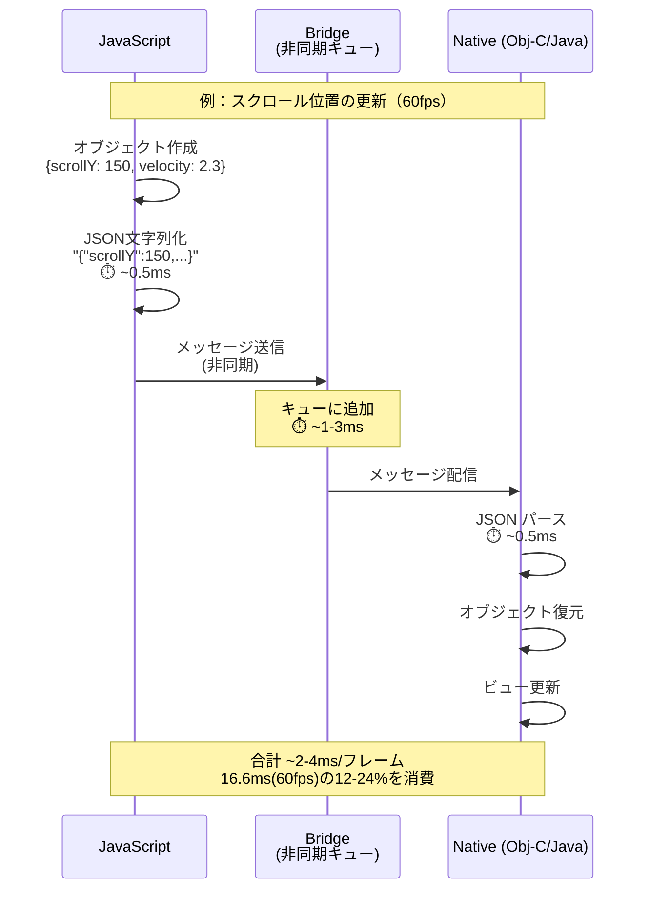
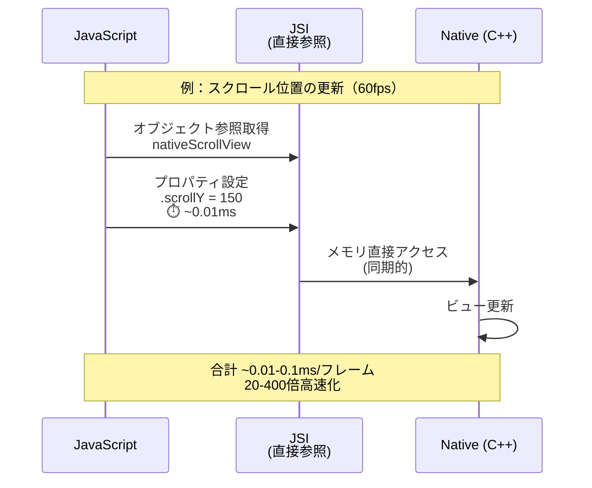
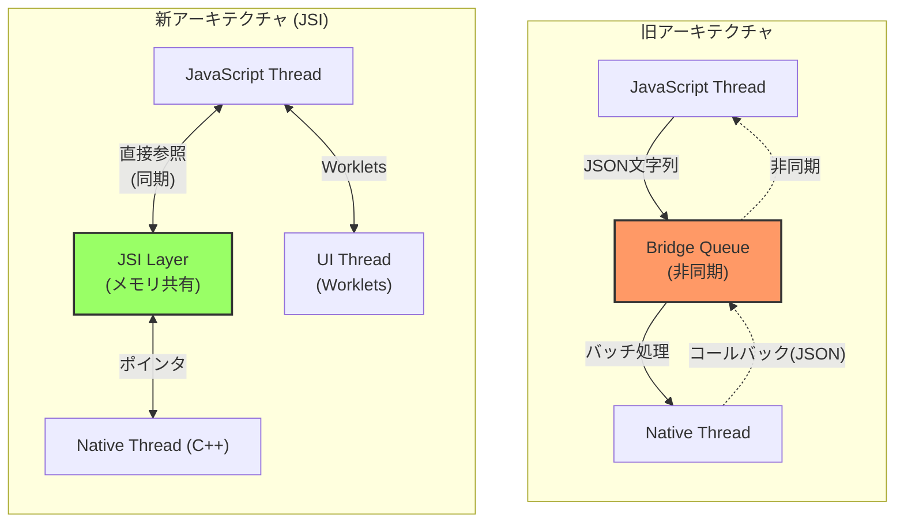
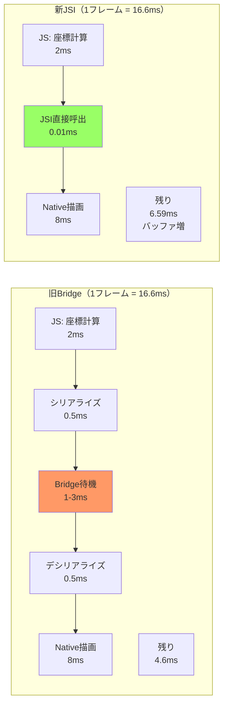

# 開発メモ

## プロジェクトのセットアップ

```bash
bunx create-expo-app@latest
```

## プロジェクトのリセット

```bash
bun run reset-project
```

## インストール方法の違い

- `npx expo install [package-name]`
- `bun add [package-name]`

基本的には `npx expo install [package-name]` が推奨
内部的に以下のことを行っている

- 互換性のチェック
- ネイティブ依存の自動処理（ネイティブコードを含むパッケージの場合、適切なバージョンを自動で判断）
- 自動セットアップ（必要に応じて追加の依存関係もインストール）
- パッケージマネージャーの自動検出

## React Native New Architecture (JSI)

### JSI とは

`JavaScript` とネイティブ間の非同期ブリッジが廃止され、代わりに `JSI (JavaScript Interface)` が導入された。

**JSI の特徴:**

- JS が C++ オブジェクト参照を保持できる
- C++ が JS オブジェクト参照を保持できる
- メモリ参照を利用することで**シリアライゼーションのコストなしに**メソッド呼び出しが可能

### シリアライゼーション削減のメリット

旧アーキテクチャでは、JavaScript と Native 間でデータをやり取りする際に：

1. **JavaScript 側**: オブジェクトを JSON 文字列に変換（シリアライゼーション）
2. **Bridge**: 非同期キューで文字列を送信
3. **Native 側**: JSON 文字列をパースしてオブジェクトに復元（デシリアライゼーション）

この変換プロセスは CPU を消費し、特に大きなデータや頻繁な呼び出しでは顕著なオーバーヘッドになる。

**具体的な改善:**

- **パフォーマンス**: アニメーションやジェスチャーのような高頻度な処理が滑らかに（20-400倍高速化）
- **同期的な実行**: Bridge の非同期制約から解放され、即座にネイティブ機能を呼べる
- **メモリ効率**: 大きなデータ（画像、3D メッシュなど）を変換せず直接共有

### アーキテクチャ比較図

#### 旧アーキテクチャ（Bridge）- シーケンス図



#### 新アーキテクチャ（JSI）- シーケンス図



#### アーキテクチャ構造比較



#### データフロー比較（アニメーションの例）



### 重要ポイント

1. **レイテンシの削減**: Bridge の非同期キューによる待機時間（1-3ms）が完全に消滅。60fps では 1 フレームが 16.6ms なので、この削減は体感できるレベル。

2. **同期的な実行**: 旧 Bridge では結果を即座に取得できなかったが、JSI では `const result = nativeModule.calculate()` のような同期呼び出しが可能に。これにより複雑な制御フローが書きやすくなった。

3. **Worklets の実現**: JSI があるからこそ、JavaScript を UI Thread で直接実行する Worklets が可能に。これが `react-native-reanimated` や `react-native-skia` の高パフォーマンスの秘密。
