# 開発メモ

## プロジェクトのセットアップ

```bash
bunx create-expo-app@latest
```

## プロジェクトのリセット

```bash
bun run reset-project
```

## インストール方法の違い

- `npx expo install [package-name]`
- `bun add [package-name]`

基本的には `npx expo install [package-name]` が推奨
内部的に以下のことを行っている

- 互換性のチェック
- ネイティブ依存の自動処理（ネイティブコードを含むパッケージの場合、適切なバージョンを自動で判断）
- 自動セットアップ（必要に応じて追加の依存関係もインストール）
- パッケージマネージャーの自動検出

## React Native New Architecture (JSI)

### JSI とは

`JavaScript` とネイティブ間の非同期ブリッジが廃止され、代わりに `JSI (JavaScript Interface)` が導入された。

**JSI の特徴:**

- JS が C++ オブジェクト参照を保持できる
- C++ が JS オブジェクト参照を保持できる
- メモリ参照を利用することで**シリアライゼーションのコストなしに**メソッド呼び出しが可能

### シリアライゼーション削減のメリット

旧アーキテクチャでは、JavaScript と Native 間でデータをやり取りする際に：

1. **JavaScript 側**: オブジェクトを JSON 文字列に変換（シリアライゼーション）
2. **Bridge**: 非同期キューで文字列を送信
3. **Native 側**: JSON 文字列をパースしてオブジェクトに復元（デシリアライゼーション）

この変換プロセスは CPU を消費し、特に大きなデータや頻繁な呼び出しでは顕著なオーバーヘッドになる。

**具体的な改善:**

- **パフォーマンス**: アニメーションやジェスチャーのような高頻度な処理が滑らかに（20-400倍高速化）
- **同期的な実行**: Bridge の非同期制約から解放され、即座にネイティブ機能を呼べる
- **メモリ効率**: 大きなデータ（画像、3D メッシュなど）を変換せず直接共有

### アーキテクチャ比較図

#### 旧アーキテクチャ（Bridge）- シーケンス図

```mermaid
sequenceDiagram
    participant JS as JavaScript
    participant Bridge as Bridge<br/>(非同期キュー)
    participant Native as Native (Obj-C/Java)

    Note over JS,Native: 例：スクロール位置の更新（60fps）

    JS->>JS: オブジェクト作成<br/>{scrollY: 150, velocity: 2.3}
    JS->>JS: JSON文字列化<br/>"{"scrollY":150,...}"<br/>⏱️ ~0.5ms
    JS->>Bridge: メッセージ送信<br/>(非同期)
    Note over Bridge: キューに追加<br/>⏱️ ~1-3ms
    Bridge->>Native: メッセージ配信
    Native->>Native: JSON パース<br/>⏱️ ~0.5ms
    Native->>Native: オブジェクト復元
    Native->>Native: ビュー更新

    Note over JS,Native: 合計 ~2-4ms/フレーム<br/>16.6ms(60fps)の12-24%を消費
```



#### 新アーキテクチャ（JSI）- シーケンス図

```mermaid
sequenceDiagram
    participant JS as JavaScript
    participant JSI as JSI<br/>(直接参照)
    participant Native as Native (C++)

    Note over JS,Native: 例：スクロール位置の更新（60fps）

    JS->>JSI: オブジェクト参照取得<br/>nativeScrollView
    JS->>JSI: プロパティ設定<br/>.scrollY = 150<br/>⏱️ ~0.01ms
    JSI->>Native: メモリ直接アクセス<br/>(同期的)
    Native->>Native: ビュー更新

    Note over JS,Native: 合計 ~0.01-0.1ms/フレーム<br/>20-400倍高速化
```



#### アーキテクチャ構造比較

```mermaid
graph TB
    subgraph old["旧アーキテクチャ"]
        direction TB
        JSThread["JavaScript Thread"]
        BridgeQ["Bridge Queue<br/>(非同期)"]
        NativeThread["Native Thread"]

        JSThread -->|"JSON文字列"| BridgeQ
        BridgeQ -->|"バッチ処理"| NativeThread
        NativeThread -.->|"コールバック(JSON)"| BridgeQ
        BridgeQ -.->|"非同期"| JSThread

        style BridgeQ fill:#f96,stroke:#333,stroke-width:2px
    end

    subgraph new["新アーキテクチャ (JSI)"]
        direction TB
        JSThread2["JavaScript Thread"]
        JSI["JSI Layer<br/>(メモリ共有)"]
        NativeThread2["Native Thread (C++)"]
        UIThread["UI Thread<br/>(Worklets)"]

        JSThread2 <-->|"直接参照<br/>(同期)"| JSI
        JSI <-->|"ポインタ"| NativeThread2
        JSThread2 <-->|"Worklets"| UIThread

        style JSI fill:#9f6,stroke:#333,stroke-width:2px
    end
```



#### データフロー比較（アニメーションの例）

```mermaid
flowchart LR
    subgraph bridge["旧Bridge（1フレーム = 16.6ms）"]
        direction TB
        B1["JS: 座標計算<br/>2ms"] --> B2["シリアライズ<br/>0.5ms"]
        B2 --> B3["Bridge待機<br/>1-3ms"]
        B3 --> B4["デシリアライズ<br/>0.5ms"]
        B4 --> B5["Native描画<br/>8ms"]
        B6["残り<br/>4.6ms"]

        style B3 fill:#f96
    end

    subgraph jsi["新JSI（1フレーム = 16.6ms）"]
        direction TB
        J1["JS: 座標計算<br/>2ms"] --> J2["JSI直接呼出<br/>0.01ms"]
        J2 --> J3["Native描画<br/>8ms"]
        J4["残り<br/>6.59ms<br/>バッファ増"]

        style J2 fill:#9f6
    end
```



### 重要ポイント

1. **レイテンシの削減**: Bridge の非同期キューによる待機時間（1-3ms）が完全に消滅。60fps では 1 フレームが 16.6ms なので、この削減は体感できるレベル。

2. **同期的な実行**: 旧 Bridge では結果を即座に取得できなかったが、JSI では `const result = nativeModule.calculate()` のような同期呼び出しが可能に。これにより複雑な制御フローが書きやすくなった。

3. **Worklets の実現**: JSI があるからこそ、JavaScript を UI Thread で直接実行する Worklets が可能に。これが `react-native-reanimated` や `react-native-skia` の高パフォーマンスの秘密。

### このプロジェクトでの影響

R3F と Skia を統合する際、毎フレーム数千の頂点データや変換行列を扱うことになるため、JSI の恩恵を最大限受けられる。特に：

- **R3F のレンダリング**: 3D オブジェクトの頂点・法線・UV データを直接共有
- **Skia Canvas**: 描画命令を同期的に実行
- **Reanimated との連携**: `useSharedValue` を使って UI と 3D を同期

## Fabric レンダラー

### Fabric とは

Fabric は React Native の新しい**レンダリングシステム**。JSI を土台として、同期的で高速な UI 更新を実現する。

**旧レンダラー（Paper）からの主な変更:**

| 観点                     | 旧レンダラー（Paper）        | Fabric                                |
| ------------------------ | ---------------------------- | ------------------------------------- |
| 通信方法                 | Bridge 経由（非同期）        | JSI 経由（同期可能）                  |
| レンダリングパイプライン | JavaScript → Bridge → Native | JavaScript → C++ Shadow Tree → Native |
| レイアウト計算           | Native 側でシングルスレッド  | C++ で並列処理可能                    |
| 同期的な測定             | 不可（コールバック必須）     | 可能（即座に値取得）                  |
| UI 更新のタイミング      | バッチ処理で遅延             | フレームに同期                        |

### JSI との関係

**JSI と Fabric の役割分担:**

```
JSI（JavaScript Interface）
  ↓ メモリ共有の仕組み
  └─ JavaScript ⇄ C++ 間でオブジェクト参照を直接やり取り

Fabric（レンダリングシステム）
  ↓ JSI を活用
  └─ UI の状態変更を高速にネイティブビューに反映
```

**具体例:**

```javascript
// 旧 Bridge: 非同期でしか取得できない
UIManager.measure(nodeHandle, (x, y, width, height) => {
  // コールバックで受け取る（1-3ms 後）
  console.log(height);
});

// 新 Fabric + JSI: 同期的に即座に取得
const height = nativeView.measure().height; // 即座に値が返る
```

### Fabric の 3 フェーズレンダリング

Fabric は UI 更新を 3 つのフェーズに分けて処理する：

```
1. Render Phase（JS Thread）
   ├─ React が Component tree を作成
   ├─ Props/State の変更を検出
   └─ Shadow Tree（軽量な中間表現）を生成

2. Layout Phase（Fabric Thread）
   ├─ Yoga（レイアウトエンジン）で寸法・位置を計算
   ├─ Shadow Tree に計算結果を記録
   └─ 複数要素を並列計算可能（マルチスレッド）

3. Commit Phase（UI Thread）
   ├─ Native View Hierarchy に変更を反映
   ├─ GPU レンダリング命令を発行
   └─ 画面に描画
```

### レンダリング比較図

#### 旧レンダラー（Paper）vs Fabric

```mermaid
graph TB
    subgraph old["旧レンダラー（Paper + Bridge）"]
        direction TB
        O1["React Component<br/>状態変更"]
        O2["Bridge<br/>（非同期キュー）"]
        O3["Native UI Manager<br/>（メインスレッド）"]
        O4["レイアウト計算<br/>（シングルスレッド）"]
        O5["描画"]

        O1 -->|"JSON送信<br/>1-3ms"| O2
        O2 -->|"バッチ処理"| O3
        O3 --> O4
        O4 --> O5

        style O2 fill:#f96
    end

    subgraph new["新レンダラー（Fabric + JSI）"]
        direction TB
        N1["React Component<br/>状態変更"]
        N2["JSI Layer<br/>（同期）"]
        N3["C++ Shadow Tree<br/>（軽量表現）"]
        N4["並列レイアウト計算<br/>（Fabric Thread）"]
        N5["描画<br/>（UI Thread）"]

        N1 -->|"メモリ共有<br/>0.01ms"| N2
        N2 --> N3
        N3 --> N4
        N4 --> N5

        style N2 fill:#9f6
        style N4 fill:#9cf
    end
```



#### Fabric の 3 フェーズレンダリング（シーケンス図）

```mermaid
sequenceDiagram
    participant React as React<br/>(JS Thread)
    participant Shadow as Shadow Tree<br/>(C++ Fabric Thread)
    participant Native as Native Views<br/>(UI Thread)
    participant GPU as GPU

    Note over React,GPU: 例：ボタンの色を変更

    React->>React: 1. Render Phase<br/>Component tree 更新<br/>⏱️ ~0.5ms
    React->>Shadow: JSI経由で変更通知<br/>⏱️ ~0.01ms
    Shadow->>Shadow: 2. Layout Phase<br/>Yoga でレイアウト計算<br/>⏱️ ~0.2ms (並列可能)
    Shadow->>Native: 3. Commit Phase<br/>変更を反映
    Native->>GPU: GPU描画命令
    GPU->>GPU: 画面に描画

    Note over React,GPU: 合計 ~0.71ms<br/>旧Bridgeの約1/3-1/5
```



### このプロジェクトでの Fabric 有効化

`app.json` の設定により自動的に有効化されている：

```json
{
  "expo": {
    "newArchEnabled": true // ← Fabric + TurboModules を有効化
  }
}
```

この設定により、Expo が React Native 新アーキテクチャをビルドに含め、すべての UI 更新が Fabric パイプラインで処理される。

### このプロジェクトでの Fabric の重要性

#### UI と 3D の同期

```mermaid
graph TB
    subgraph project["このプロジェクト (Fabric + JSI)"]
        direction TB

        React["React 19<br/>Component Tree"]
        JSI["JSI Layer<br/>（メモリ共有）"]

        subgraph rendering["レンダリングシステム"]
            Fabric["Fabric<br/>（UI Views）"]
            Skia["Skia Canvas<br/>（2D/3D）"]
        end

        R3F["React Three Fiber<br/>（3D シーン）"]
        Reanimated["Reanimated<br/>Shared Values"]

        React --> JSI
        JSI --> Fabric
        JSI --> Skia
        React --> R3F
        R3F --> Skia
        Reanimated -.->|"Worklets<br/>（UI Thread）"| Fabric
        Reanimated -.->|"同期"| R3F

        style JSI fill:#9f6
        style Fabric fill:#9cf
        style Skia fill:#fc9
    end
```



#### 具体的なメリット

1. **UI と 3D の同期アニメーション**

   Reanimated の `useSharedValue` を使うと、UI Thread で直接 JavaScript が実行される（Worklets）。これは Fabric + JSI があるからこそ実現：

   ```javascript
   const offset = useSharedValue(0);

   // Fabric: UI Thread で直接実行
   useAnimatedStyle(() => ({
     transform: [{ translateY: offset.value }],
   }));

   // R3F: 同じ値を 3D オブジェクトにも適用
   useFrame(() => {
     mesh.position.y = offset.value / 100;
   });
   ```

2. **並列レイアウト計算**

   複雑な UI（リスト、グリッド）のレイアウトを複数スレッドで並列計算。60fps を維持しやすくなる。

3. **同期的なビュー測定**

   3D オブジェクトのサイズを UI に合わせる際、ビューのサイズを即座に取得可能：

   ```javascript
   // Fabric: 同期的に測定
   const viewHeight = nativeView.measure().height;

   // R3F: 3D オブジェクトのスケールを調整
   mesh.scale.y = viewHeight / 100;
   ```

### 重要ポイント

1. **JSI は土台、Fabric はレンダリングシステム**
   - JSI: JavaScript ⇄ C++ 間のメモリ共有の仕組み
   - Fabric: JSI を使って UI を高速レンダリング

2. **3 フェーズによる効率化**
   - Render（JS）→ Layout（Fabric Thread・並列）→ Commit（UI Thread）
   - レイアウト計算を並列化することで、複雑な UI でも 60fps を維持

3. **Worklets の実現**
   - Fabric + JSI により UI Thread で JavaScript を直接実行
   - Reanimated で UI-3D 同期アニメーションが可能に

4. **旧 Bridge との性能差**
   - 旧: ~2-4ms/フレーム（Bridge 待機含む）
   - 新: ~0.71ms/フレーム（約 1/3〜1/5 に短縮）

## TurboModules

### TurboModules とは

TurboModules は React Native の新しいアーキテクチャにおける**ネイティブモジュール（Native Module）の次世代実装**。JSI を活用して、JavaScript とネイティブコード間の通信を根本的に高速化したシステム。

**役割の違い:**

- **JSI**: JavaScript ⇄ C++ 間のメモリ共有（通信基盤）
- **Fabric**: UI の高速レンダリング（画面描画）
- **TurboModules**: カメラ、位置情報、ファイルなどの**ネイティブ機能**へのアクセス

**具体例:**

```
Fabric → 「ボタンを表示する」「色を変える」
TurboModules → 「カメラで写真を撮る」「位置情報を取得する」
```

### 旧 Native Modules との違い

**主な違い一覧:**

| 観点                     | 旧 Native Modules          | TurboModules                |
| ------------------------ | -------------------------- | --------------------------- |
| **通信方法**             | Bridge（非同期）           | JSI（同期可能）             |
| **シリアライゼーション** | JSON 文字列化（毎回）      | なし（メモリ参照）          |
| **初期化**               | アプリ起動時（全て）       | 使用時のみ（遅延ロード）    |
| **パフォーマンス**       | 基準（1x）                 | 10-1000倍高速               |
| **型安全性**             | 限定的                     | TypeScript/Flow 統合        |
| **API アクセス**         | `NativeModules.ModuleName` | `TurboModuleRegistry.get()` |

**パフォーマンス比較（実測値）:**

| 操作                   | Native Modules | TurboModules | 改善率    |
| ---------------------- | -------------- | ------------ | --------- |
| ネイティブメソッド呼出 | 2-4ms          | 0.01-0.1ms   | 20-400倍  |
| 大量データ転送         | 20-100ms       | 0.1-1ms      | 20-1000倍 |

### アーキテクチャ比較図

#### 旧 Native Modules（Bridge 経由）

```mermaid
sequenceDiagram
    participant JS as JavaScript
    participant Bridge as Bridge<br/>(非同期キュー)
    participant Native as Native Code

    Note over JS,Native: 例：カメラで写真を撮影

    JS->>JS: 引数をJSON化<br/>⏱️ ~0.5ms
    JS->>Bridge: メッセージ送信<br/>（非同期）
    Note over Bridge: キュー待機<br/>⏱️ 2-3ms
    Bridge->>Native: デシリアライズ<br/>⏱️ ~0.5ms
    Native->>Native: カメラ起動
    Native->>Bridge: 結果をJSON化<br/>⏱️ ~0.5ms
    Note over Bridge: キュー待機<br/>⏱️ 2-3ms
    Bridge->>JS: デシリアライズ<br/>⏱️ ~0.5ms

    Note over JS,Native: 合計 ~6-8ms<br/>（処理前後のオーバーヘッド）
```



#### TurboModules（JSI 経由）

```mermaid
sequenceDiagram
    participant JS as JavaScript
    participant JSI as JSI Layer<br/>(TurboModule)
    participant Native as Native Code

    Note over JS,Native: 例：カメラで写真を撮影

    JS->>JSI: JSI経由で直接呼出<br/>⏱️ ~0.01ms
    JSI->>Native: メモリ参照で実行<br/>（同期的）
    Native->>Native: カメラ起動
    Native->>JSI: メモリ参照で返却
    JSI->>JS: 結果を直接返す<br/>⏱️ ~0.01ms

    Note over JS,Native: 合計 ~0.02ms<br/>（300-400倍高速化）
```



### JSI・Fabric・TurboModules の関係

#### 3層アーキテクチャ

```mermaid
graph TB
    subgraph architecture["React Native 新アーキテクチャ"]
        direction TB

        React["React 19<br/>Component Tree"]

        subgraph layer3["Layer 3: アプリケーション層"]
            direction LR
            TM["TurboModules<br/>（ネイティブ機能）<br/>カメラ・位置情報・ファイル"]
            Fabric["Fabric<br/>（UI レンダリング）<br/>ボタン・テキスト・レイアウト"]
        end

        subgraph layer2["Layer 2: 通信基盤"]
            JSI["JSI<br/>（メモリ共有）"]
        end

        subgraph layer1["Layer 1: ネイティブ実装"]
            direction LR
            NativeModules["Native Modules<br/>（カメラ、センサー等）"]
            NativeViews["Native Views<br/>（UIButton、TextView等）"]
        end

        React --> JSI
        JSI --> TM
        JSI --> Fabric
        TM --> NativeModules
        Fabric --> NativeViews

        style JSI fill:#9f6
        style TM fill:#f9c
        style Fabric fill:#9cf
    end
```



**役割分担:**

```
Level 1: JSI（基盤インフラ）
  └─ JavaScript ⇄ C++ 間のメモリ共有メカニズム

Level 2-A: Fabric（UI レンダリング）
  └─ JSI を使って UI 更新を高速化

Level 2-B: TurboModules（ネイティブ機能）
  └─ JSI を使ってネイティブ機能へアクセス
```

### TurboModules の主な特徴

#### 1. 遅延初期化（Lazy Loading）

**旧 Native Modules:**

```javascript
// アプリ起動時にすべてのモジュールをロード
// ↓ 起動が遅い（使わない機能もロードされる）
import { NativeModules } from "react-native";
const { Camera, GPS, FileSystem, Bluetooth } = NativeModules;
// すべて起動時にメモリに常駐
```

**TurboModules:**

```javascript
// 使用時にのみロード
// ↓ 起動が速い（必要な機能だけロード）
import { TurboModuleRegistry } from "react-native";

// 実際に使うタイミングでロード
const Camera = TurboModuleRegistry.get("RNCamera");
```

#### 2. 同期的な実行

**旧 Native Modules（非同期のみ）:**

```javascript
// コールバックでしか受け取れない
CameraModule.getMeasurements((error, result) => {
  // 2-3ms 後に実行される
  console.log(result.width);
});
```

**TurboModules（同期可能）:**

```javascript
// 即座に値が返る
const measurements = Camera.getMeasurements();
console.log(measurements.width); // すぐ使える
```

#### 3. 型安全性

**旧 Native Modules:**

```javascript
// 型定義が不完全
NativeModules.Camera.takePicture("wrong", "types"); // 実行時エラー
```

**TurboModules:**

```typescript
// TypeScript で型安全
interface CameraModule {
  takePicture(options: PhotoOptions): Promise<PhotoResult>;
}

const Camera = TurboModuleRegistry.get<CameraModule>("RNCamera");
Camera.takePicture("wrong"); // コンパイルエラー（型が合わない）
```

### このプロジェクトでの TurboModules

#### 有効化状況

`app.json` の設定により自動的に有効化：

```json
{
  "expo": {
    "newArchEnabled": true // ← TurboModules + Fabric + JSI を有効化
  }
}
```

#### 現在使用中のパッケージ

**TurboModules/JSI 対応済み:**

```
✅ react-native-reanimated (4.1.1)
   └─ JSI ベース・TurboModules 対応
   └─ Worklets で UI Thread 上の JavaScript 実行

✅ react-native-worklets (0.5.1)
   └─ JSI ワーカー実装

✅ expo-* パッケージ
   └─ Expo TurboModules で提供
```

**今後統合予定:**

```
🔜 @shopify/react-native-skia
   └─ JSI + TurboModules で高性能 Canvas 描画

🔜 @react-three/fiber (R3F)
   └─ Skia レンダラー経由で TurboModules 活用
```

#### 実際の活用例

**Reanimated が TurboModules を活用:**

```javascript
import { useSharedValue, useAnimatedStyle } from "react-native-reanimated";

// Reanimated は内部で TurboModules + JSI を活用
const offset = useSharedValue(0);
// ↑ この値は JSI を通じて UI Thread と共有される（TurboModules インフラ）

useAnimatedStyle(() => ({
  // ↑ Worklet として UI Thread で実行（JSI + TurboModules）
  transform: [{ translateY: offset.value }],
}));
```

**R3F と UI の同期（今後の実装）:**

```javascript
const offset = useSharedValue(0);

// Fabric: UI のアニメーション
useAnimatedStyle(() => ({
  transform: [{ translateY: offset.value }],
}));

// R3F: 3D オブジェクトの位置（同じ値を使用）
useFrame(() => {
  // TurboModules を通じて同期的にアクセス
  mesh.position.y = offset.value / 100;
});
```

### このプロジェクトでの重要性

#### パフォーマンスへの影響

**シナリオ: スクロール連動 3D（60fps）**

```
1フレーム = 16.6ms

旧 Native Modules:
  ├─ JS 計算          2ms
  ├─ JSON 化          0.5ms
  ├─ Bridge 待機      2-3ms  ← ボトルネック
  ├─ デシリアライズ    0.5ms
  ├─ Native 描画      8ms
  └─ 合計: 13-14ms / フレーム
     → 60fps 維持が困難

新 TurboModules + JSI:
  ├─ JS 計算          2ms
  ├─ JSI 直接呼出     0.01ms  ← ほぼ無視できる
  ├─ Native 描画      8ms
  └─ 合計: 10.01ms / フレーム
     → 6.59ms のバッファ（安定した 60fps）
```

#### メモリ効率

**3D メッシュデータの共有例:**

```javascript
// 旧: JSON 経由で毎フレーム変換（遅い＆メモリ消費）
const vertices = [
  /* 10000頂点 */
];
const serialized = JSON.stringify(vertices); // 変換コスト大
bridge.send(serialized);

// 新: TurboModules でメモリ参照を直接共有（高速＆効率的）
const vertices = new Float32Array([
  /* 10000頂点 */
]);
TurboModule.updateMesh(vertices); // メモリ参照を渡すだけ
```

### 重要ポイント

1. **JSI は土台、TurboModules はネイティブ機能アクセス**
   - JSI: メモリ共有の仕組み
   - Fabric: UI レンダリング
   - TurboModules: ネイティブ機能（カメラ、センサー等）

2. **遅延初期化でアプリ起動を高速化**
   - 旧: すべてのモジュールを起動時にロード
   - 新: 使用時のみロード → 起動時間短縮

3. **同期的な呼び出しが可能**
   - 複雑な計算（3D オブジェクトのサイズ取得 → UI 調整）が簡単に
   - コールバック地獄から解放

4. **パフォーマンス改善**
   - 10-1000倍の高速化（実測値）
   - R3F/Skia での毎フレーム処理に最適

## uniwind のセットアップ

最初から導入するなら

```bash
npx create-expo-app -e with-router-uniwind
```

あとから導入するなら

```bash
 % npx expo install uniwind tailwindcss
```

導入後にやったこと

- プロジェクトルートに `src` ディレクトリの作成
- `src/global.css` を作成して下記の内容を追加

  ```css
  @import "tailwindcss";
  @import "uniwind";
  ```

- プロジェクトルートに `metro.config.js` を作成して下記の内容を追加(公式ドキュメントからそのまま引用)

  ```js
  const { getDefaultConfig } = require("expo/metro-config");
  const { withUniwindConfig } = require("uniwind/metro"); // make sure this import exists

  /** @type {import('expo/metro-config').MetroConfig} */
  const config = getDefaultConfig(__dirname);

  // Apply uniwind modifications before exporting
  const uniwindConfig = withUniwindConfig(config, {
    // relative path to your global.css file
    cssEntryFile: "./src/global.css",
    // optional: path to typings
    dtsFile: "./src/uniwind-types.d.ts",
  });

  module.exports = uniwindConfig;
  ```

- intellisense を追加するため `.vscode/setting.json` に下記の内容を追加

  ```json
  "tailwindCSS.classAttributes": [
    "class",
    "className",
    "headerClassName",
    "contentContainerClassName",
    "columnWrapperClassName",
    "endFillColorClassName",
    "imageClassName",
    "tintColorClassName",
    "ios_backgroundColorClassName",
    "thumbColorClassName",
    "trackColorOnClassName",
    "trackColorOffClassName",
    "selectionColorClassName",
    "cursorColorClassName",
    "underlineColorAndroidClassName",
    "placeholderTextColorClassName",
    "selectionHandleColorClassName",
    "colorsClassName",
    "progressBackgroundColorClassName",
    "titleColorClassName",
    "underlayColorClassName",
    "colorClassName",
    "drawerBackgroundColorClassName",
    "statusBarBackgroundColorClassName",
    "backdropColorClassName",
    "backgroundColorClassName",
    "ListFooterComponentClassName",
    "ListHeaderComponentClassName"
  ],
  "tailwindCSS.classFunctions": ["useResolveClassNames"]
  ```

- `tsconfig.json` の更新

src ディレクリを追加したのでそちらに対応

```json
{
  "extends": "expo/tsconfig.base",
  "compilerOptions": {
    "strict": true,
    "paths": {
      "@/*": ["./src/*"] // "./*" → "./src/*" に変更
    }
  },
  "include": ["**/*.ts", "**/*.tsx", ".expo/types/**/*.ts", "expo-env.d.ts"]
}
```

uniwind はセットアップを学べたので満足
